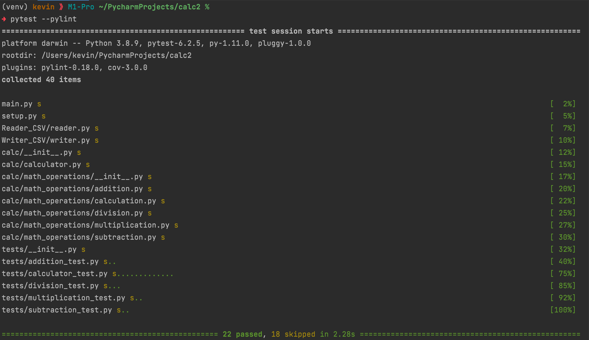

# Kevin Ramos
# IS218-005
## Fall 2021

### Create a calculator -with a CSV READER AND WRITER

[Main.py](https://github.com/kevnramos/calc2/blob/csv_with_main/main.py)

[CSV_Writer](https://github.com/kevnramos/calc2/blob/csv_with_main/Writer_CSV/writer.py)

[CSV_Reader](https://github.com/kevnramos/calc2/blob/csv_with_main/Reader_CSV/reader.py)

### Linting

### Coverage

